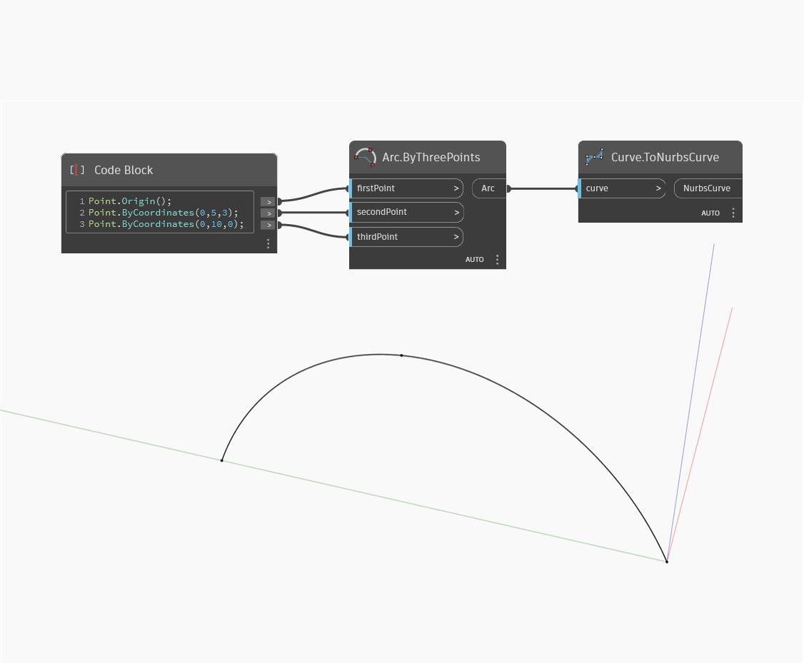

## In Depth
To Nurbs Curve takes a curve as input, and returns a Nurbs curve that approximates the input curve. In the example below, we create an arc by using a Code Block to define three points and using an Arc.ByThreePoints node. This arc is converted to a Nurbs Curve by using a ToNurbsCurve node. Note that the default degree of the resulting Nurbs Curve is 3.
___
## Example File

