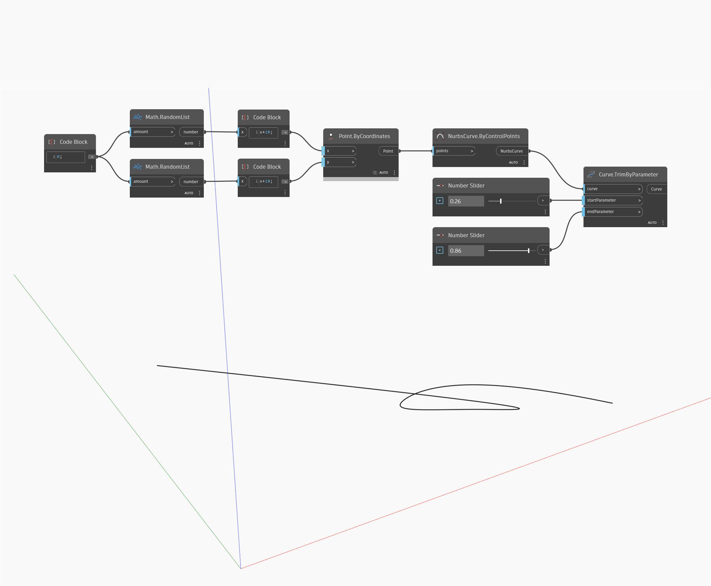

## In Depth
Trim By Parameter will remove the start and end of an input curve by trimming the curve at the specified parameters, and will return the resulting middle section of the curve. In the example below, we first create a Nurbs Curve using a ByControlPoints node, with a set of randomly generated points as the input. Two number sliders set to the range 0 to 1 are used to control the start and end parameter inputs for a TrimByParameter node.
___
## Example File

