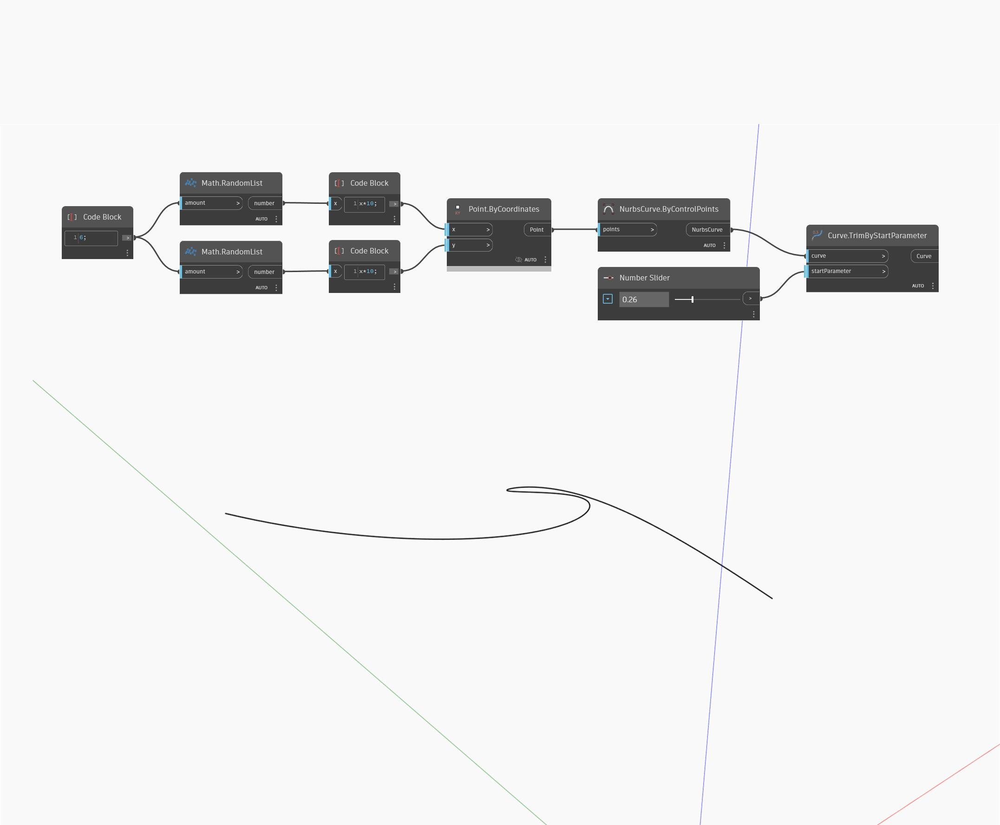

## In Depth
Trim By Start Parameter will remove the beginning of an input curve by trimming the curve at the specified parameter. In the example below, we first create a Nurbs Curve using a ByControlPoints node, with a set of randomly generated points as the input. A number slider set to the range 0 to 1 is used to control the parameter input for a TrimByStartParameter node.
___
## Example File

