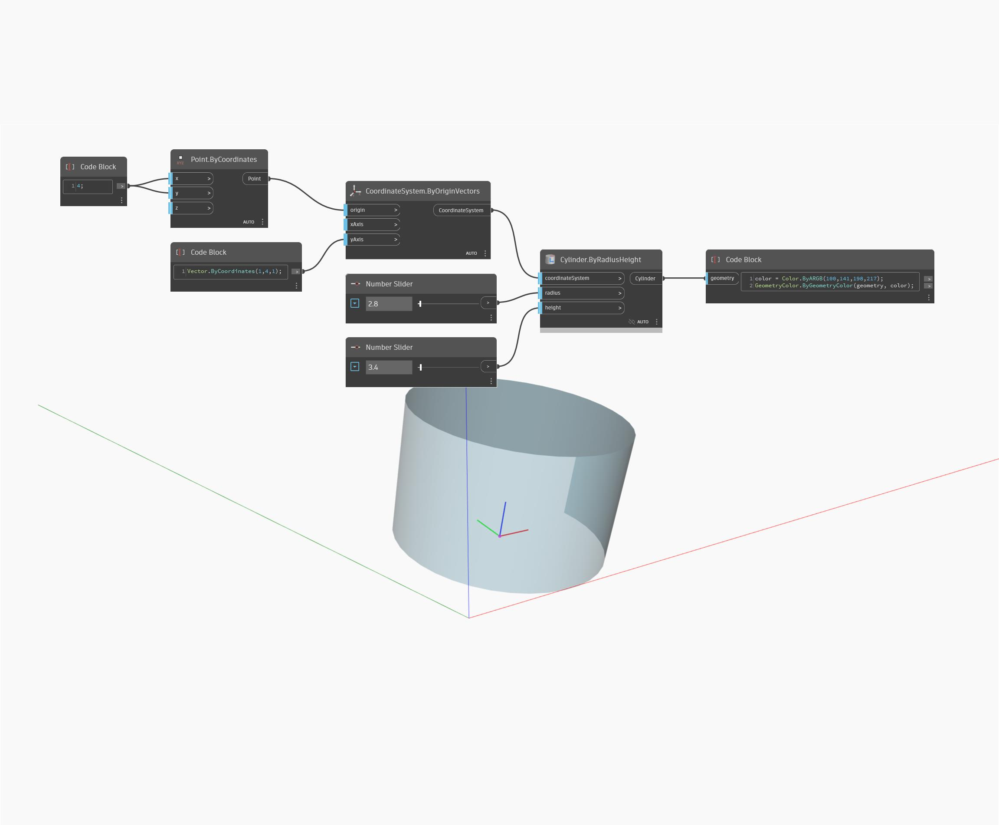

## In Depth
ByRadiusHeight will return a Cylinder based on a CoordinateSystem. In the example below, a CoordinateSystem from an origin point and a YAxis vector is used to create Cylinder that appears rotated.
___
## Example File

