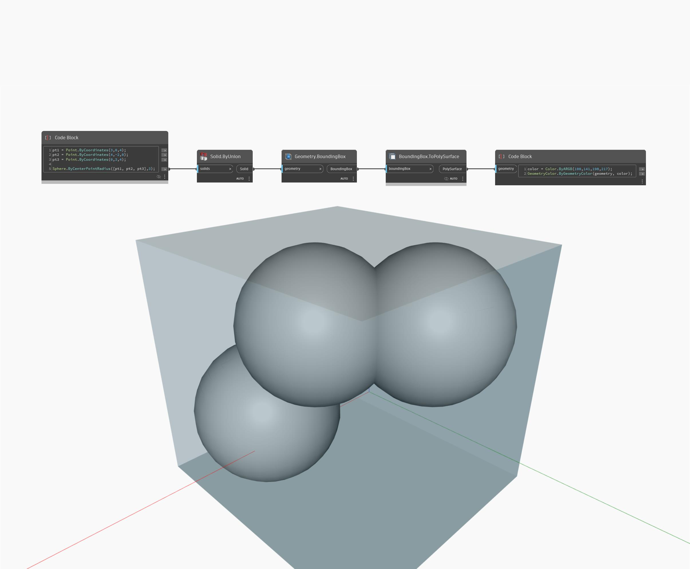

## In Depth
`Geometry.BoundingBox` returns a box defined by the geometry it contains. A BoundingBox is not displayed, but it can be returned as a PolySurface by using the `BoundingBox.ToPolySurface` node. 

In the example below, a BoundingBox is created for a unioned solid and represented as a PolySurface.

___
## Example File

