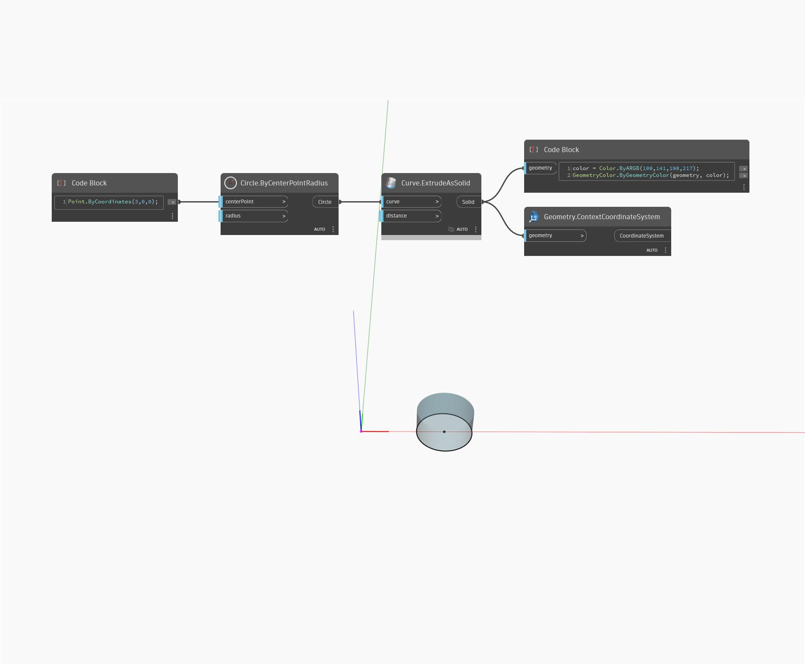

## In Depth
ContextCoordinateSystem will return the CoordinateSystem that was used in creating a piece of geometry. In the example below, a Solid created at centerPoint (3,0,0) returns a CoordinateSystem located at the origin.
___
## Example File

