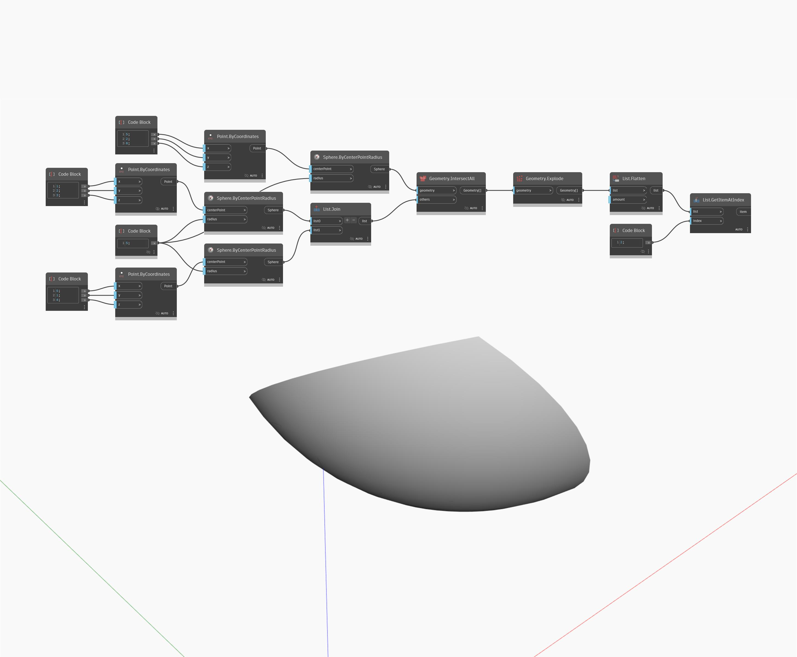

## In Depth
The Geometry Explode Node breaks a geometry down into smaller components. For example, a Polysurface can be Exploded into several Surfaces and a Polycurve into curves. In this example, we are extracting a single Surface from a complex Intersection of three Spheres.
___
## Example File

