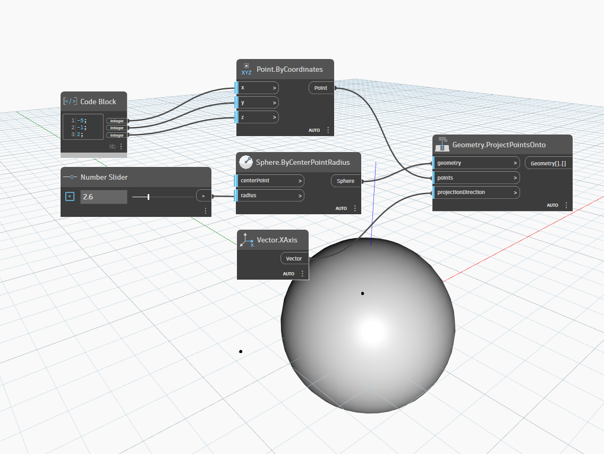

## In Depth
`Geometry.ProjectPointsOnto` projects a collection of points onto a geometry along a specified vector direction, returning the resulting geometry where the projections intersect the target surface. This node is useful for mapping points onto complex geometries, creating surface patterns, or analyzing spatial relationships between points and surfaces.

### How it works
The node casts imaginary rays from each input point, following the direction of the `projectionDirection` vector. Where these rays intersect the target `geometry`, new geometry is created at the intersection points. The projection only works in the positive direction of the vector—rays are not cast backward.

### Inputs and outputs
- **geometry**: The target geometry (surface, solid, or mesh) onto which points will be projected
- **points**: A collection of one or more points to project. Can be a single point or a list of points
- **projectionDirection**: A vector defining the direction of projection. The projection follows this direction from each point

The node returns a flat array of resulting geometry at the intersection points. If a projection ray does not intersect the target geometry, that particular projection returns null.

### Important considerations
- **Direction matters**: Projection only occurs in the positive direction of the vector. To project in both directions, you may need to use the node twice with opposite vectors
- **Null results**: Points that don't intersect the geometry in the given direction will return null. Use `List.Clean` to remove null values if needed
- **Performance**: Projecting large numbers of points onto complex geometry can be computationally intensive. Consider simplifying geometry or reducing point counts for better performance

### Use cases
- Creating surface patterns by projecting a grid of points onto curved surfaces
- Analyzing line-of-sight or shadow projections
- Mapping 2D patterns onto 3D forms
- Finding closest points on a surface in a specific direction

### Example
In the example below, a single point is created at coordinates (-5, -1, 2) using a code block. A sphere with a radius of 2.6 is created as the target geometry. The point is projected onto the sphere along the world X-axis (Vector.XAxis), which points in the positive X direction. The result is a point on the sphere's surface where the projection ray intersects it. You can modify the number slider to change the sphere's radius and see how it affects the projection result.
___
## Example File

