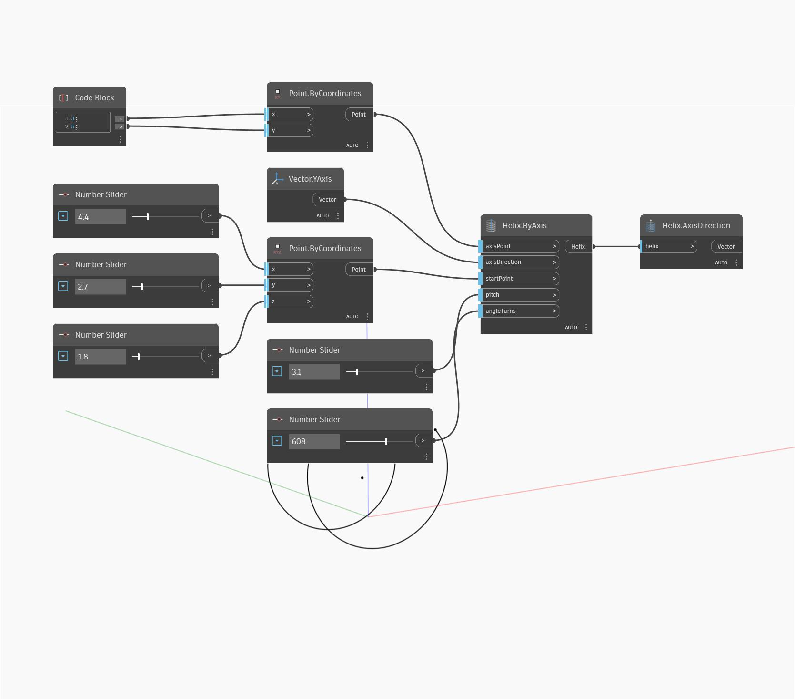

## In Depth
Axis Direction will return the direction of the central axis of a helix as a vector. Together with the Axis Point, this defines the central axis. In the example below, we create a helix using Helix By Axis, then use Axis Direction to find the direction of the helix axis.
___
## Example File

