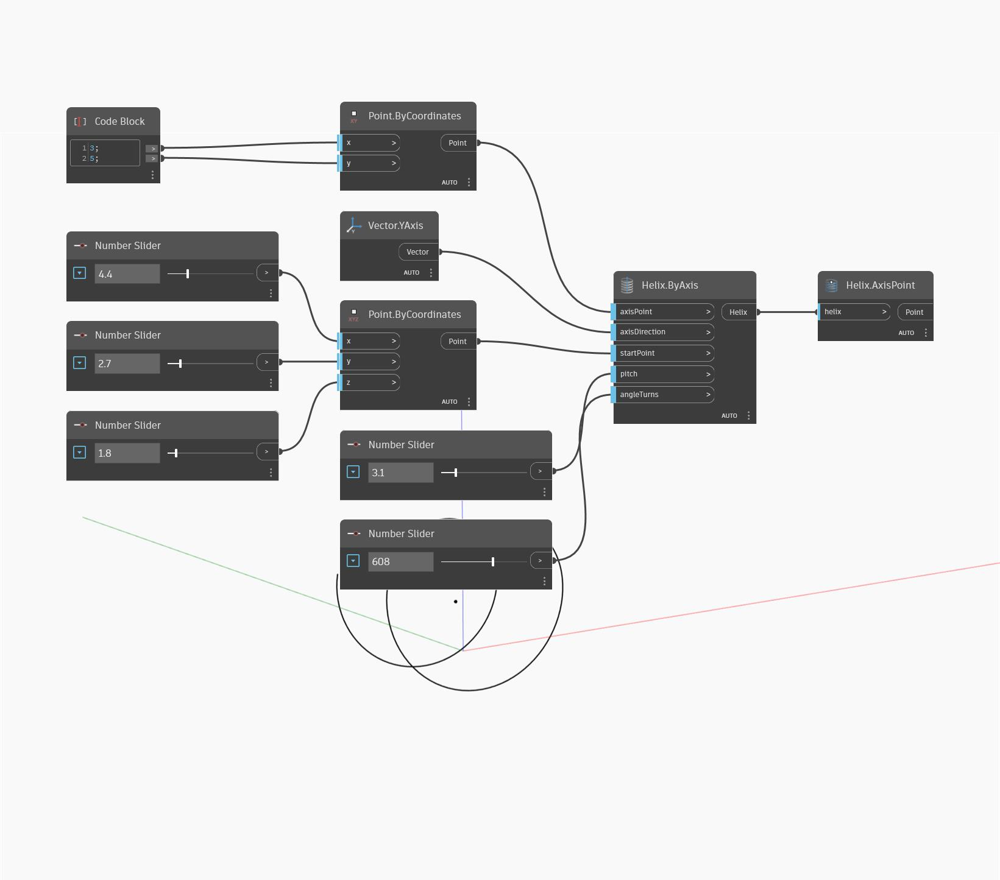

## In Depth
Axis Point will return the base point of the helix axis. Together with the Axis Direction, this defines the central axis of a helix. In the example below, we create a helix using Helix By Axis, then use Axis Point to find the initial point of the helix axis.
___
## Example File

