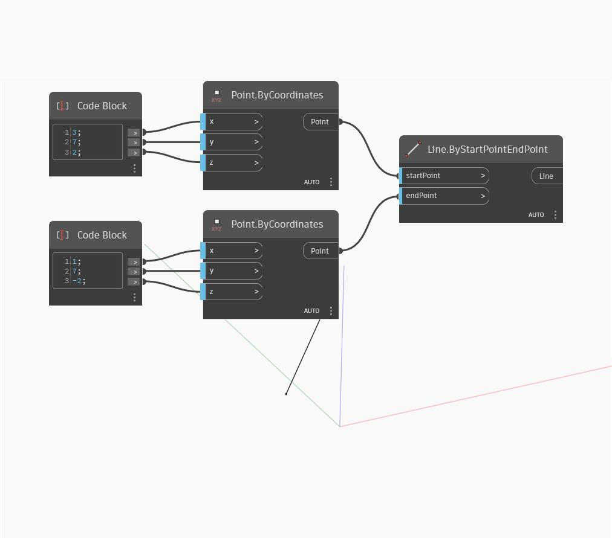

## In Depth
`Line.ByStartPointEndPoint` creates a line between two input points. 

In the example below, we use two code blocks to specify the X, Y, and Z coordinates of two points and then create a line between the two points.

___
## Example File

