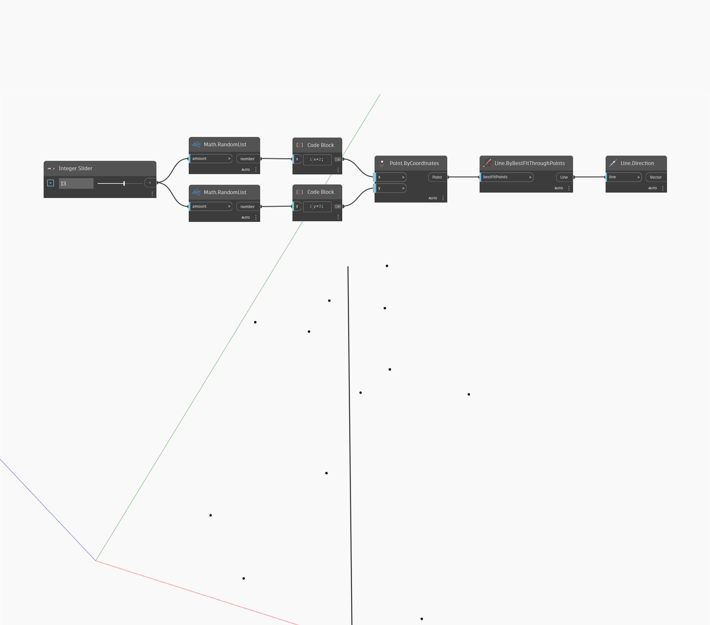

## In Depth
Direction will return a vector that points in the same direction as a line. The magnitude of the vector is equal to the length of the original line. In the example below, we generate a set of random points, and then us ByBestFitThroughPoints to create a line. We use Direction to find the vector direction of the created line.
___
## Example File

