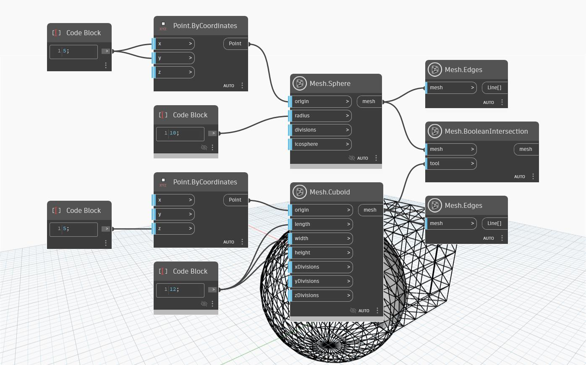

## In-Depth
`Mesh.BooleanIntersection` operation takes a target mesh and a tool mesh as input and returns only the portion of the two meshes that intersect. In the example below, the `Mesh.BooleanIntersection` node returns a mesh resulting in the intersection of a cuboid and a sphere. 

(`Mesh.Edges` nodes are used to visualize the geometries of the original and tool mesh.) 

## Example File

