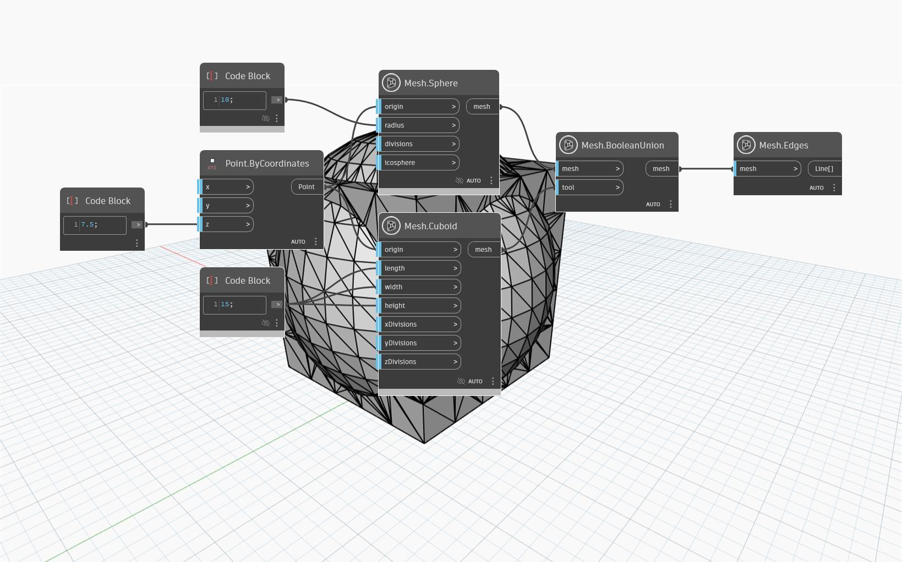

## In-Depth
`Mesh.BooleanUnion` node returns the union of the two input meshes after joining them into a single mesh and removing the overlapping portions of the meshes. 
In the example below, we use `Mesh.BooleanUnion` to unite two meshes, `Mesh.Sphere` and `Mesh.Cuboid`. 

(`Mesh.Edges` is used to visualize the structure of the mesh.) 

## Example File

