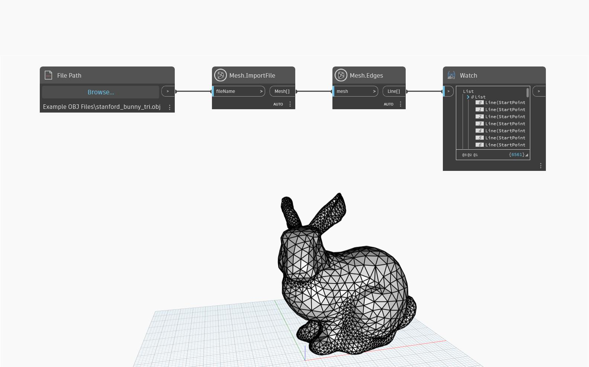

## In-Depth
`Mesh.Edges` method returns the underlying Edges of the mesh as Dynamo Lines. This node is helpful for visualizing the structure of the mesh, querying its construction as well as a step in converting a mesh or editing its shape. In the example below, `Mesh.Edges` is used on an imported mesh which provides useful information about the resolution of the mesh. 

## Example File

