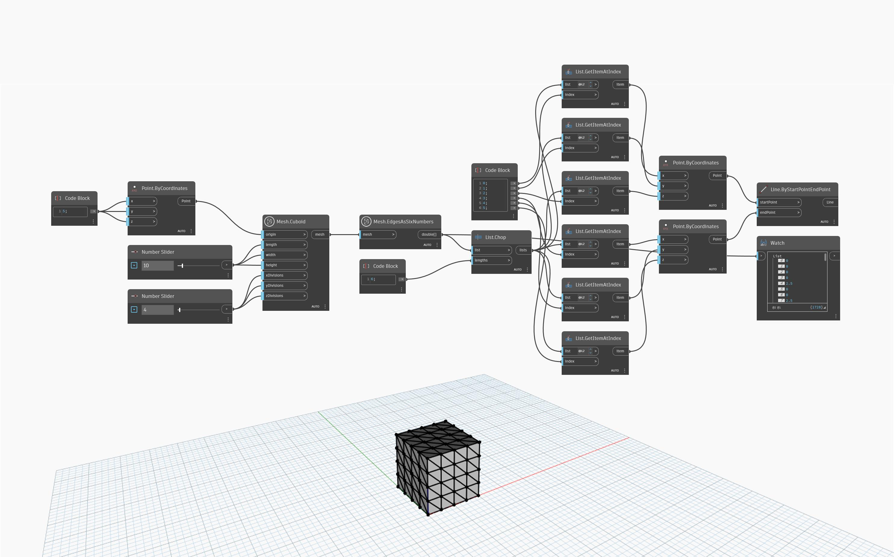

## In-Depth
`Mesh.EdgesAsSixNumbers` determines the X, Y, and Z coordinates of the vertices composing each unique edge in a provided mesh, therefore resulting in six numbers per edge. This node can be used to query or reconstruct the mesh or its edges. 

In the example below, `Mesh.Cuboid` is used to create a cuboid mesh, which is then used as input to the `Mesh.EdgesAsSixNumbers` node to retrieve the list of edges expressed as six numbers. The list is subdivided into lists of 6 items using `List.Chop`, then `List.GetItemAtIndex` and `Point.ByCoordinates` are used to reconstruct the lists of start points and end points of each edge. Finally, `List.ByStartPointEndPoint` is used to reconstruct the edges of the mesh. 

## Example File

