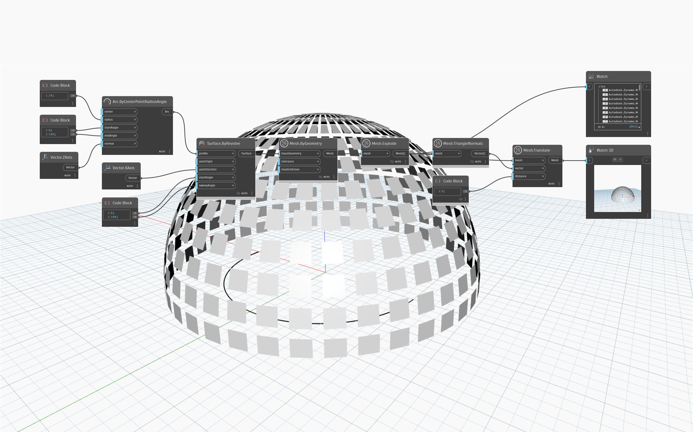

## In-Depth
`Mesh.Explode` node takes a single mesh and returns a list of mesh faces as independent meshes. 

The example below shows a mesh dome that is exploded using `Mesh.Explode`, followed by an offset of each face in the direction of the face normal. This is achieved using the `Mesh.TriangleNormals` and `Mesh.Translate` nodes. Even though in this example mesh faces appear to be quads, they are in fact triangles with identical normals. 

## Example File

