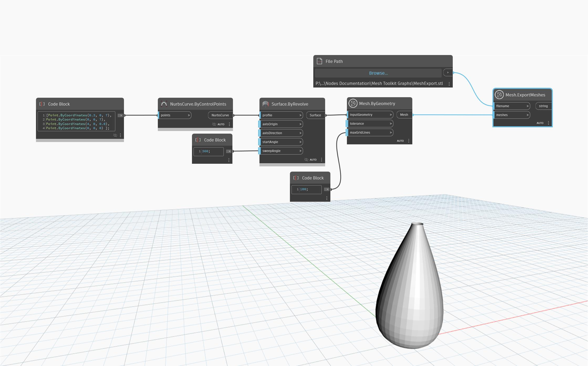

## In-Depth
`Mesh.ExportMeshes` exports the mesh into a file format. The type of mesh to export is determined by the file name extension; for instance, a file name ending in ".stl" will be exported in the STL format, like in the example below.  
The following formats are supported:
- .mix - Meshmixer
- .obj - Wavefront OBJ
- .stl - STL format
- .dae - COLLADA
- .ply - Polygon File Format

## Example File

