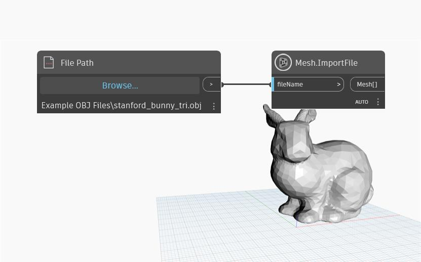

## In-Depth
`Mesh.ImportFile` takes the name of a file as input from the defined file path. The file can be of the following types:
- .obj - Wavefront OBJ file
- .mix - Meshmixer file
- .stl - STL file
- .ply - Polygon File Format

## Example File

