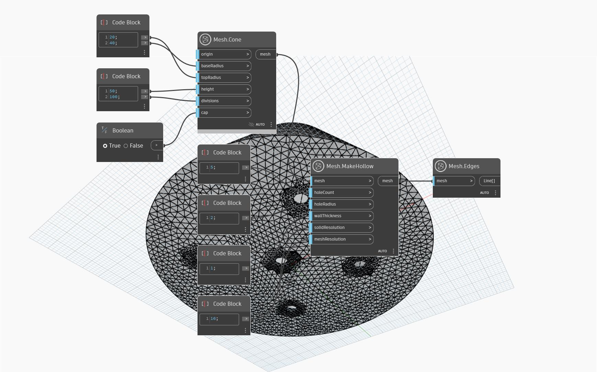

## In-Depth
`Mesh.MakeHollow` operation can be used to hollow out a mesh object in preparation for 3D printing. Hollowing a mesh can significantly reduce the amount of print material required, printing time and cost. The `wallThickness` input defines the thickness of walls of the mesh object. Optionally, `Mesh.MakeHollow` can generate escape holes to remove excess material during the printing process. The sizes and number of holes is controlled by the inputs `holeCount` and `holeRadius`. Lastly, the inputs for `meshResolution` and `solidResolution` affect the resolution of the mesh result. A higher `meshResolution` improves the accuracy to which the interior portion of the mesh offsets the original mesh but will result in more triangles. A higher `solidResolution` improves the extent to which finer details of the original mesh are preserved on the interior portion of the hollowed mesh.
In the example below, `Mesh.MakeHollow` is used on a mesh in the shape of a cone. Five escape holes are added at its base.

## Example File

