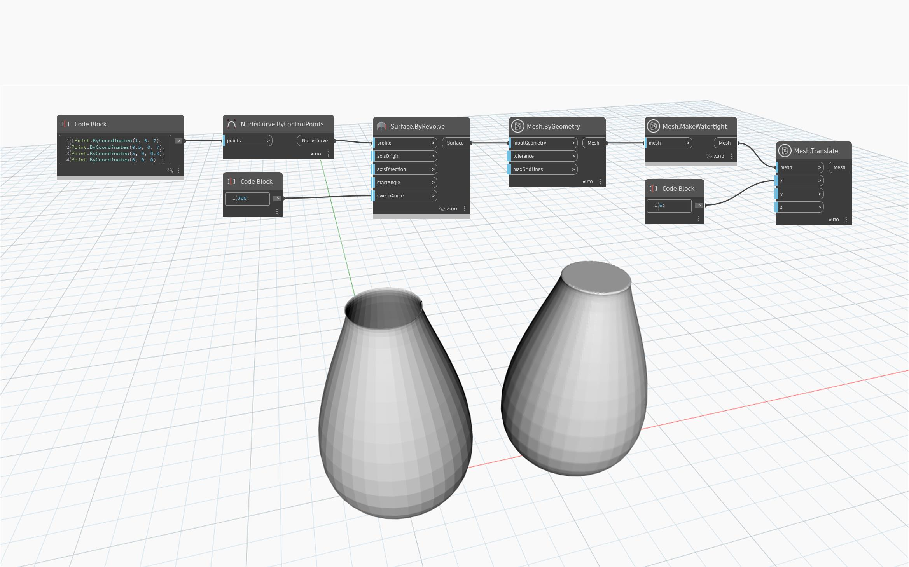

## In-Depth
`Mesh.MakeWatertight` generates a solid, watertight and 3D printable mesh by sampling the original mesh. It provides a quick way of resolving a mesh with numerous issues such as self-intersections, overlaps and non-manifold geometry. The method computes a thin-band distance field and generates a new Mesh using the marching cubes algorithm but doesn`t project back onto the original Mesh. This is more suited to mesh objects that have numerous defects or difficult issues such as self-intersections.
The example below shows a non-watertight vase and its watertight equivalent.

## Example File

