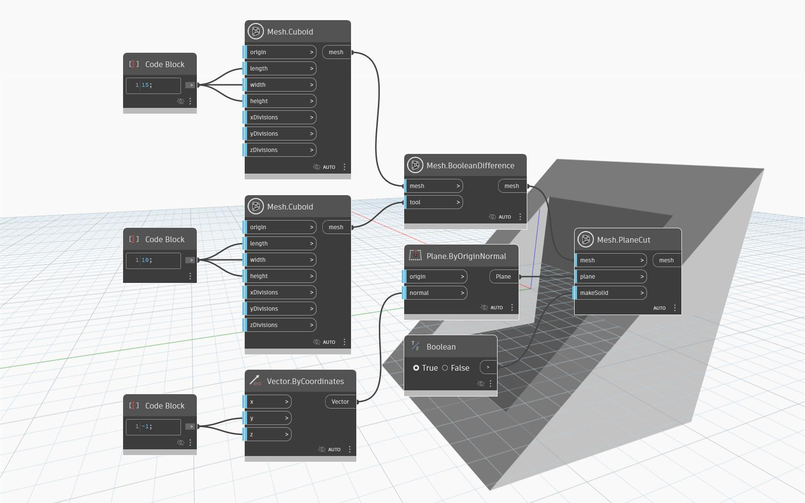

## In-Depth
`Mesh.PlaneCut` returns a mesh that has been cut by a given plane. The result of the cut is the part of the mesh that lies on the side of the plane in the direction of the normal of the `plane` input. The `makeSolid` parameter controls whether the mesh is treated as a `Solid`, in which case the cut is filled with fewest possible triangles to cover each hole. 

In the example below, a hollow mesh obtained from a `Mesh.BooleanDifference` operation is cut by a plane at an angle. 

## Example File

