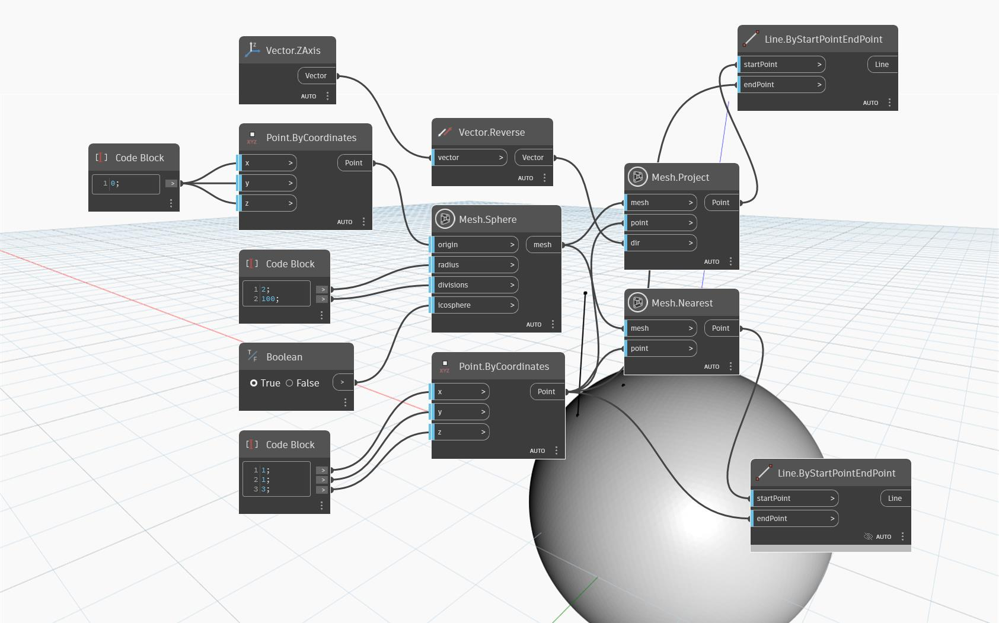

## In-Depth
`Mesh.Project` returns a point on the input Mesh that is a projection of the input point on the mesh in the direction of the given vector. For the node to work correctly, a line drawn from the input point in the direction of the input vector should intersect with the provided Mesh.  

The example graph shows a simple use case of how the node works. The input point is above a spherical Mesh, but not directly on top. The point is projected in the direction of the negative 'Z' axis vector. The resulting point is projected onto the sphere and appears right underneath the input point. This is contrasted with the output of the `Mesh.Nearest` node (using the same point and mesh as inputs) where the resulting point lies on the mesh along the 'normal vector' passing through the input point (the nearest point). `Line.ByStartAndEndPoint` is used to show the 'trajectory' of the projected point onto the Mesh.

## Example File

