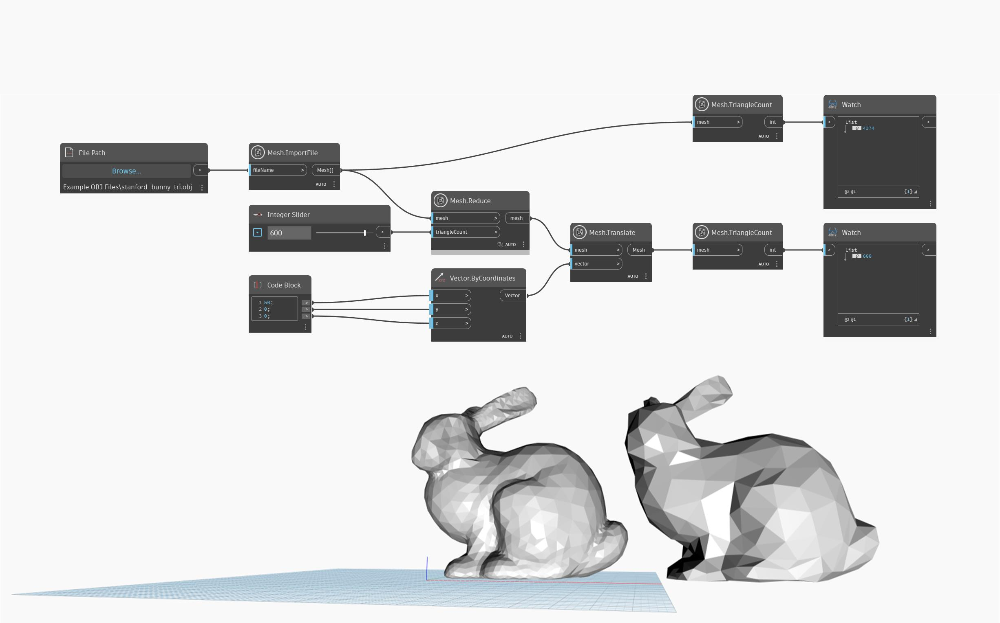

## In-Depth
`Mesh.Reduce` creates a new mesh with a reduced number of triangles. The `triangleCount` input defines the target number of triangles of the output mesh. Note that `Mesh.Reduce` may significantly alter the shape of the mesh in case of extremely aggressive `triangleCount` targets. In the example below, `Mesh.ImportFile` is used to import a mesh, which is then reduced by the `Mesh.Reduce` node and translated to another position for a better preview and comparison.

## Example File

