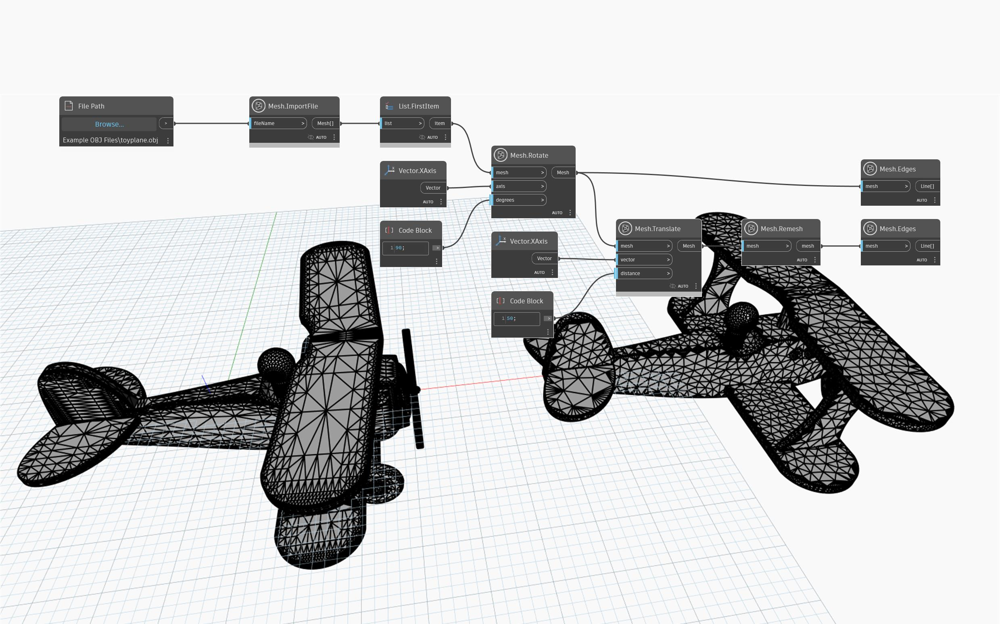

## In-Depth
`Mesh.Remesh` creates a new mesh where triangles in a given object are redistributed more evenly regardless of any change in triangle normals. This operation can be useful for meshes with variable density of triangles in order to prepare the mesh for strength analysis. Remeshing a mesh repeatedly generates progressively more uniform meshes. For meshes whose vertices are already equidistant (for example, an icosphere mesh), the result of the `Mesh.Remesh` node is the same mesh.
In the example below, `Mesh.Remesh` is used on an imported mesh with a high density of triangles in areas with fine detail. The result of the `Mesh.Remesh` node is translated to the side and `Mesh.Edges` is used to visualize the result. 

`(The example file used is licensed under creative commons)`

## Example File

