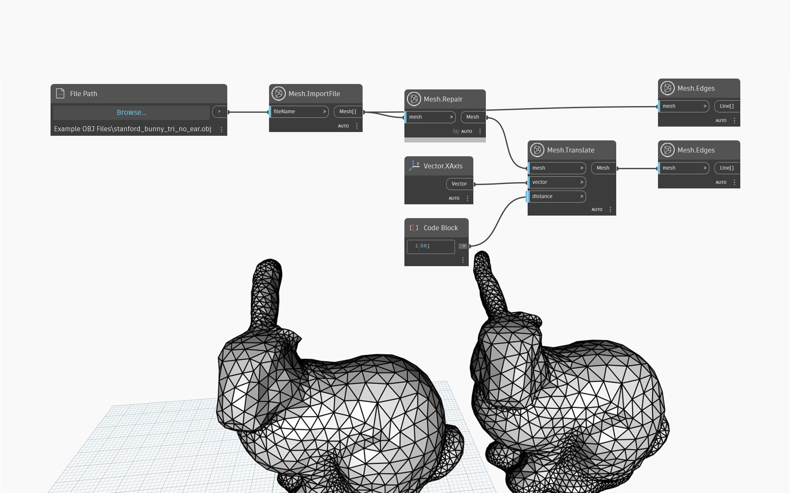

## In-Depth
Returns a new Mesh with the following defects repaired:
- Small components: if the Mesh contains very small (relative to the overall Mesh size), disconnected segments, they will be discarded.
- Holes: holes in the mesh are filled in.
- Non-manifold regions: if a vertex is connected to more than two *boundary* edges or an edge is connected to more than two triangles then the vertex/edge is non-manifold. The mesh toolkit will remove geometry until the mesh is manifold.
This method tries to preserve as much of the original mesh as possible, as opposed to MakeWatertight, which resamples the Mesh. 

In the example below, `Mesh.Repair` is used on an imported mesh to fill the hole around the bunny`s ear. 

## Example File

