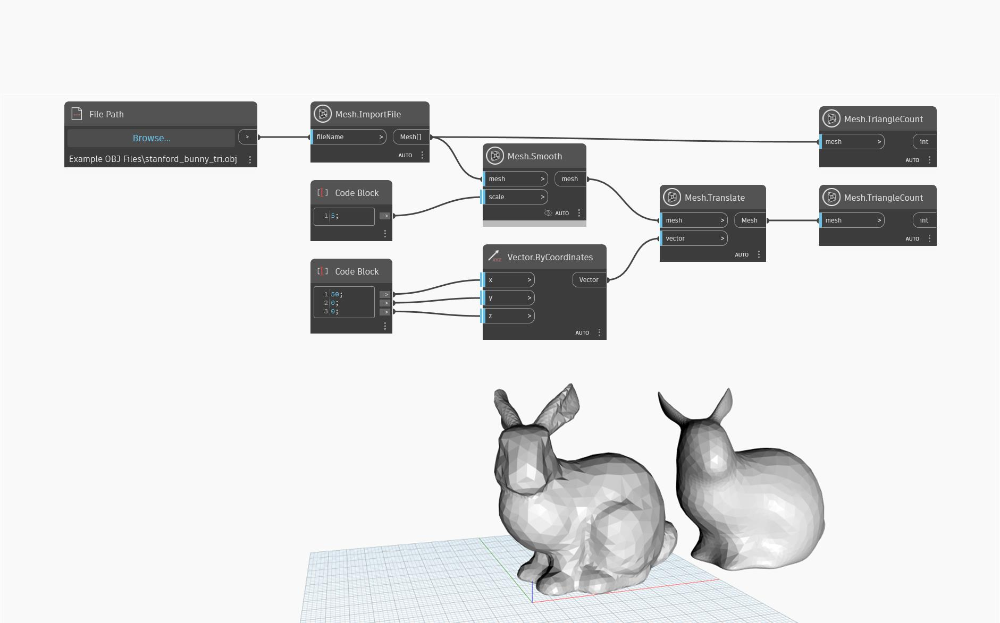

## In-Depth
This node returns a new smooth mesh using a cotangent smoothing algorithm that does not spread the vertices from their original position and is better for preserving features and edges. A scaling value needs to be input in the node to set the spatial scale of the smoothing. Scaling values can range between 0.1 and 64.0. Higher values result in a more noticeable smoothing effect, resulting in what appears to be a simpler mesh. Despite looking smoother and simpler, the new mesh has the same triangle, edge and vertex count as the initial one.

In the example below, `Mesh.ImportFile` is used to import an object. `Mesh.Smooth` is then used to smoothen the object, with a smoothing scale of 5. The object is then translated to another position with `Mesh.Translate` for a better preview, and `Mesh.TriangleCount` is used to track the number of triangles in the old and new mesh.

## Example File

