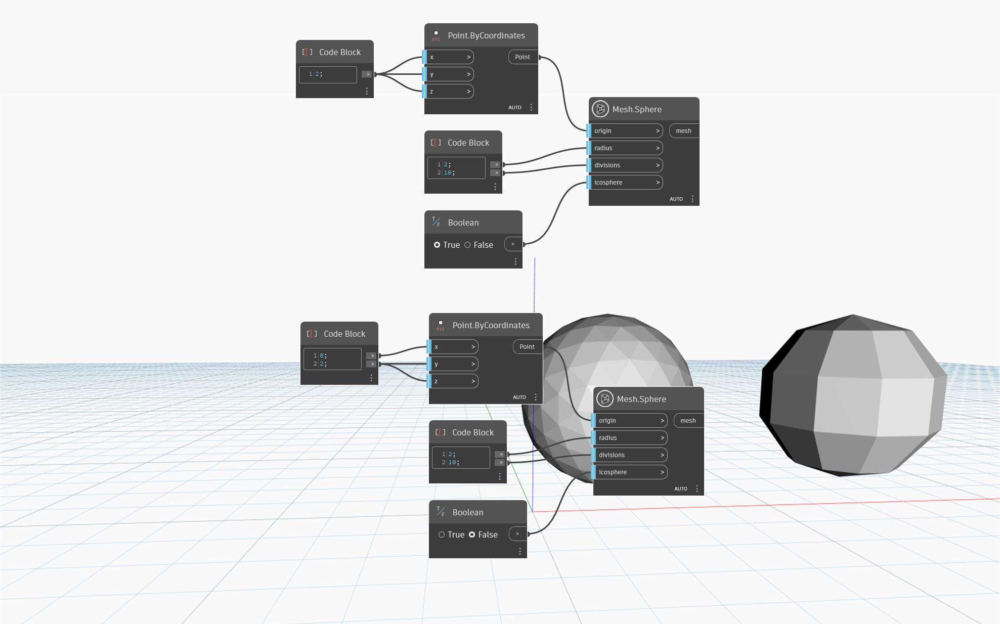

## In-Depth
`Mesh.Sphere` creates a mesh sphere, centered at the input `origin` point, with a given `radius` and a number of `divisions`. The `icosphere` boolean input is used to toggle between the `icosphere` and `UV-Sphere` spherical mesh types. An icosphere mesh covers the sphere with more regular triangles than a UV mesh and tends to give better results in downstream modeling operations. A UV mesh has its poles aligned with the sphere axis and the triangle layers are generated longitudinally around the axis. 

In the case of the icosphere, the number of triangles around the sphere axis could be as low as the specified number of divisions and at most as twice that number. The divisions of a `UV-sphere` determine the number of triangle layers generated longitudinally around the sphere. When the `divisions` input is set to zero, the node returns a UV-sphere with a default number of 32 divisions for either mesh type. 

In the example below, the `Mesh.Sphere` node is used to create two spheres with identical radius and divisions, but using different methods. When the `icosphere` input is set to `True`, the `Mesh.Sphere` returns an `icosphere`. Alternatively, when the `icosphere` input is set to `False`, the `Mesh.Sphere` node returns a `UV-sphere`.  

## Example File

