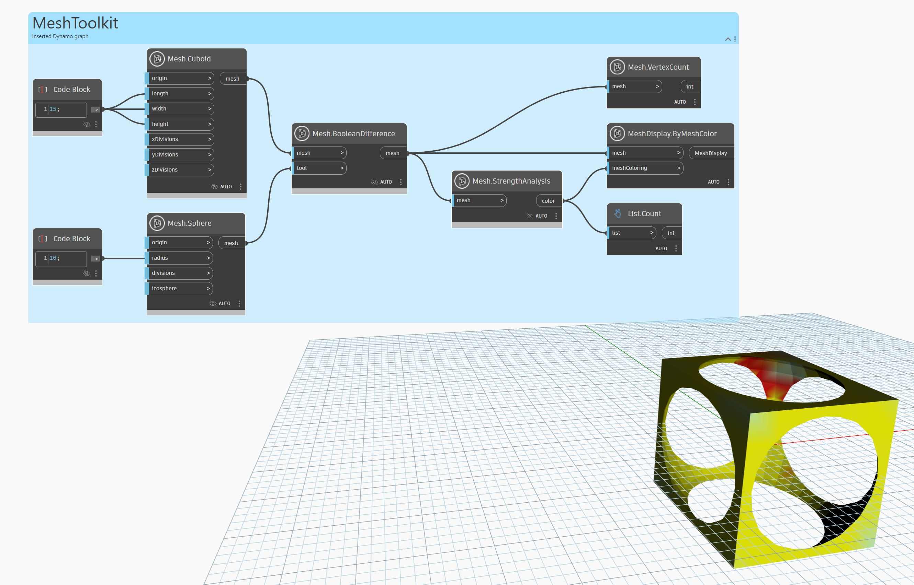

## In-Depth
 `Mesh.StrengthAnalysis` node returns a list of representative colors for each vertex. The result can be used together with the `Mesh.ByMeshColor` node. Stronger areas of the mesh are colored green whilst weaker areas are indicated by a yellow-to-red heat map. The analysis may result in false positives if the mesh is too coarse or irregular (i.e. has many long, thin triangles). You could try using `Mesh.Remesh` to generate a regular mesh before calling `Mesh.StrengthAnalysis` on it to generate better results.

In the example below, `Mesh.StrengthAnalysis` is used to color-code the structural strength of a mesh in the shape of a grid. The result is a list of colors matching the length of vertices of the mesh. This list can be used with `Mesh.ByMeshColor` node to color the mesh. 

## Example File

