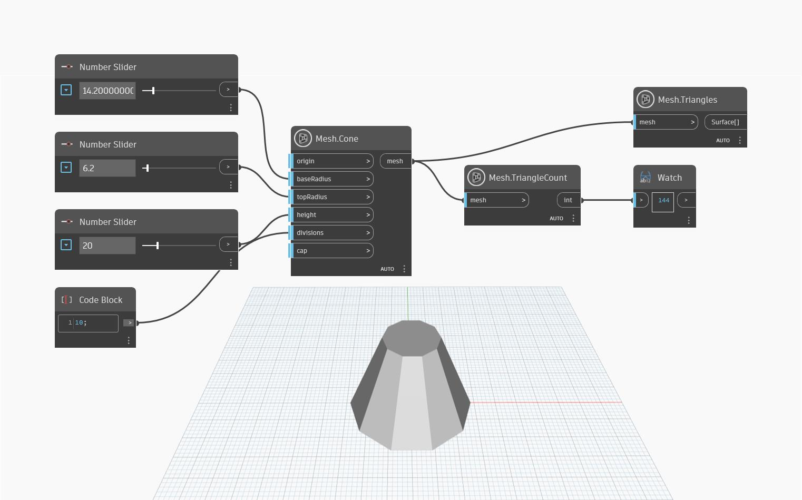

## In-Depth
`Mesh.TriangleCount` calculates the number of triangles in the mesh. In the example below, `Mesh.Cone` and `Number.Slider` are used to create a cone, which is then used as input to count the triangles. In addition to this, `Mesh.Triangles` is used to highlight the triangles of the mesh for a better preview.

## Example File

