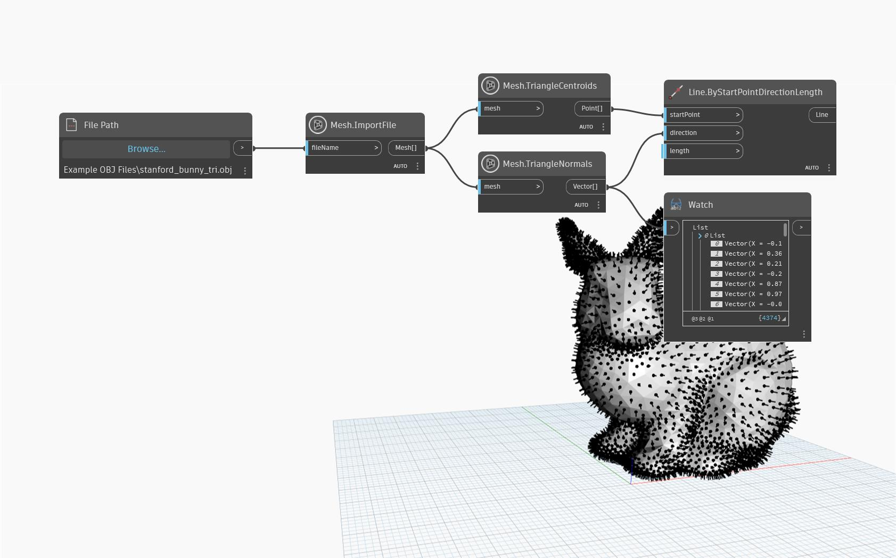

## In-Depth
In the example below, `Mesh.TriangleNormals` is used on an imported mesh and `Line.ByStartPointDirectionLength` node is used to visualize the normal vectors. `Mesh.TriangleCentroids` node is used to aid the positioning of the lines in the center of each triangle. 

## Example File

