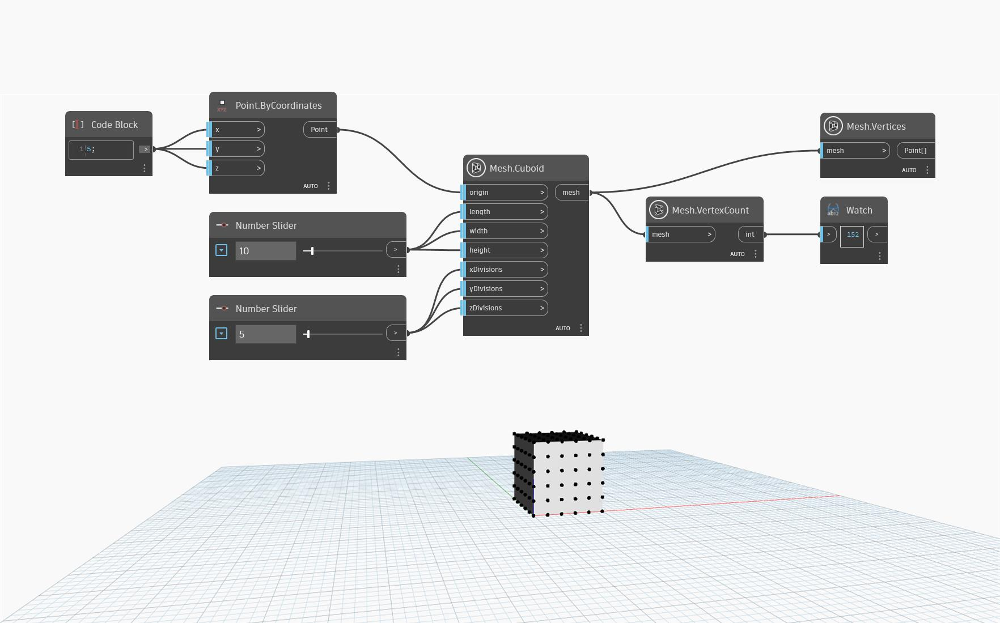

## In-Depth
This node counts the number of vertices in a provided mesh. In the example below, `Mesh.Cuboid` is used to create a cuboid mesh, which is then used as input to count the vertices. In addition to this, `Mesh.Vertices` is used to highlight the vertices of the cube for a better preview and to view the list of coordinates per vertex.

## Example File

