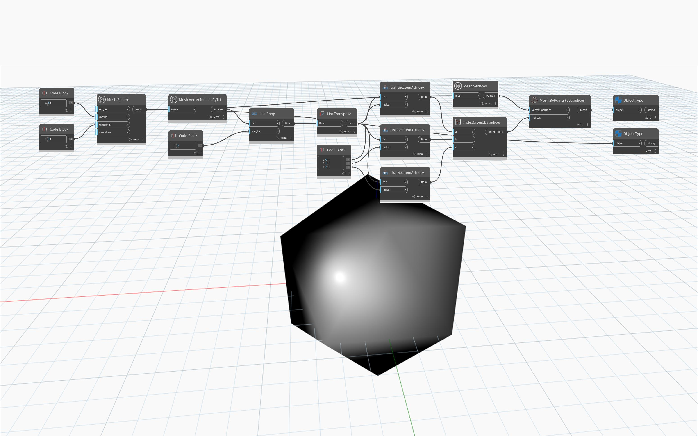

## In-Depth
`Mesh.VertexIndicesByTri` returns a flattened list of vertex indices corresponding to each mesh triangle. The indices are ordered in threes, and index groupings can be easily reconstructed using `List.Chop` node with the `lengths` input of 3. 

In the example below, a `MeshToolkit.Mesh` with 20 triangles is converted into a `Geometry.Mesh`. `Mesh.VertexIndicesByTri` is used to obtain the list of indices that is then divided into lists of threes using `List.Chop`. The list structure is flipped using `List.Transpose` to obtain three top-level lists of 20 indices corresponding to points A, B and C in each mesh triangle. `IndexGroup.ByIndices` node is used to create index groups of three indices each. The structured list of `IndexGroups` and the list of vertices is then used as input for the `Mesh.ByPointsFaceIndices` to obtain a converted mesh. 

## Example File

