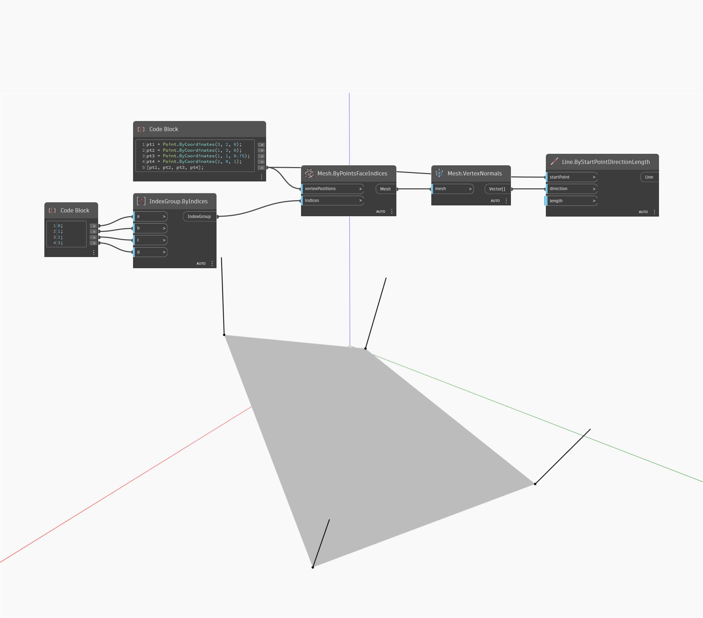

## In Depth
VertexNormals will return Vectors that represent the normal of each Vertex. In the example below, the normal of each Vertex is returned as a line to represent its direction.
___
## Example File

