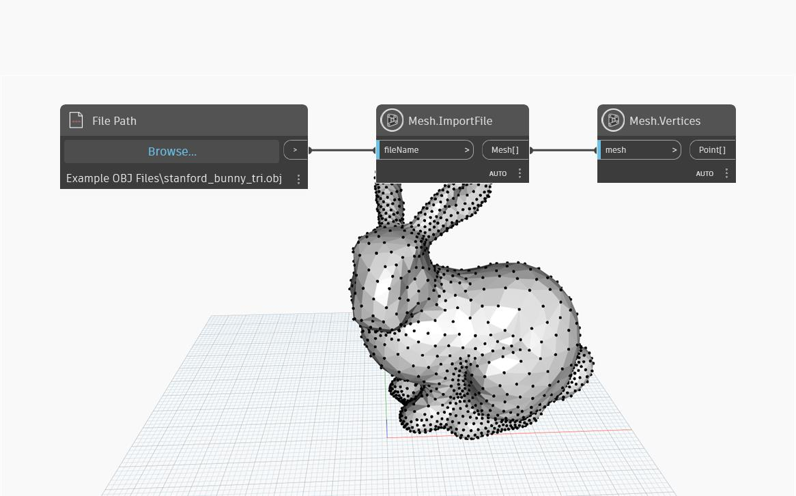

## In-Depth
`Mesh.Vertices` returns a list of unique vertices of a mesh as a list of Points. The structure of the output list is compatible with the output indices of the `Mesh.VertexIndicesByTri` node and the two can be used together to reconstruct or edit the mesh. 

## Example File

