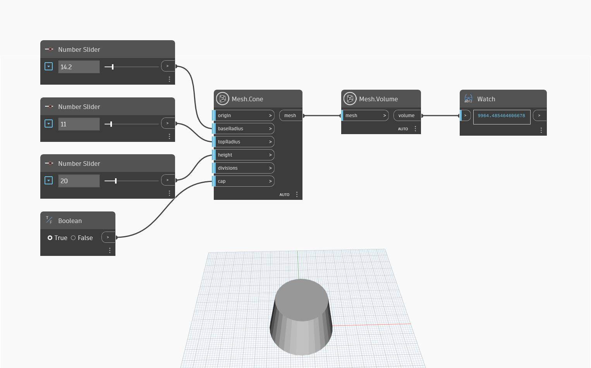

## In-Depth
`Mesh.Volume` returns the volume of a solid non-intersecting mesh. In the example below, `Mesh.Cone` and `Number.Slider` are used to create a cone, which is then used as input to count the triangles. `Mesh.Volume` can also be useful to determine if the surface of a mesh is closed. In fact, if the mesh has an open surface, the node will report a `null` value.

## Example File

