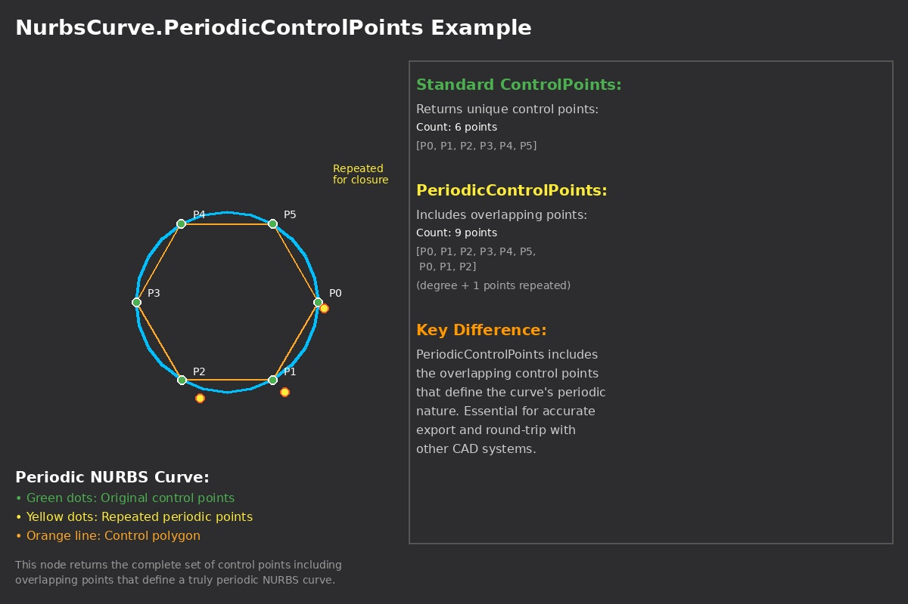

## In Depth
Use `NurbsCurve.PeriodicControlPoints` when you need to export a closed NURBS curve to another system (for example Alias) or when that system expects the curve in its periodic form. Many CAD tools expect this form for round-trip accuracy.

`PeriodicControlPoints` returns the control points in the *periodic* form. `ControlPoints` returns them in the *clamped* form. Both arrays have the same number of points; they are two different ways to describe the same curve. In the periodic form, the last few control points match the first few (as many as the curve degree), so the curve closes smoothly. The clamped form uses a different layout, so the point positions in the two arrays differ.

In the example below, a periodic NURBS curve is built with `NurbsCurve.ByControlPointsWeightsKnots`. Watch nodes compare `ControlPoints` and `PeriodicControlPoints` so you can see the same length but different point positions. The ControlPoints are seen with a red color so they appear distinctly from the PeriodicControlPoints, which are in black, in the background preview.
___
## Example File

