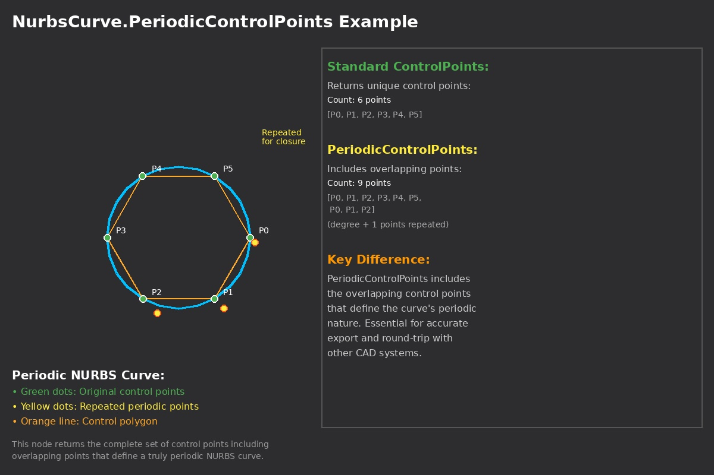

## In Depth
PeriodicControlPoints returns the truly periodic control points of a periodic NURBS curve. Unlike the standard ControlPoints property which returns the base set of control points, PeriodicControlPoints includes the additional control points that are necessary to define the curve's periodic behavior, ensuring accurate representation and manipulation of closed curves.

A periodic NURBS curve requires overlapping control points at the beginning and end to maintain smoothness and continuity at the closure. While the ControlPoints property returns only the unique control points, PeriodicControlPoints returns the complete set including these repeated points, which is essential for preserving the curve's geometric integrity during operations like export, modification, or round-trip workflows with other CAD systems.

In the example below, we create a periodic NURBS curve using NurbsCurve.ByControlPoints with the isPeriodic parameter set to true. We then compare the output of the standard ControlPoints property with PeriodicControlPoints. The PeriodicControlPoints output will contain additional control points at the end that match those at the beginning, demonstrating the curve's periodic structure.

This node is critical when working with periodic curves in data exchange scenarios, particularly with applications like Alias, or when you need to analyze or modify the complete mathematical definition of a closed NURBS curve while maintaining its periodic properties.
___
## Example File

