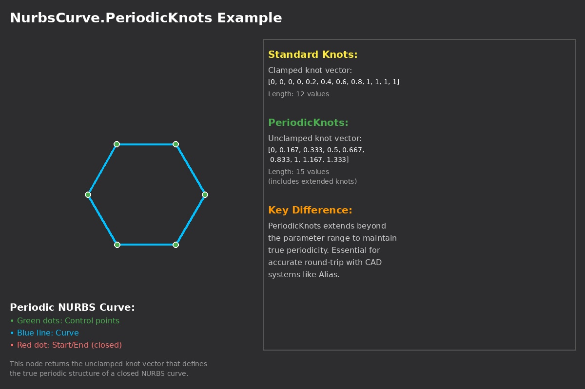

## In Depth
Use `NurbsCurve.PeriodicKnots` when you need to export a closed NURBS curve to another system (for example Alias) or when that system expects the curve in its periodic form. Many CAD tools expect this form for round-trip accuracy.

`PeriodicKnots` returns the knot vector in the *periodic* (unclamped) form. `Knots` returns it in the *clamped* form. Both arrays have the same length; they are two different ways to describe the same curve. In the clamped form, knots repeat at the start and end so the curve is pinned to the parameter range. In the periodic form, the knot spacing repeats at the start and end instead, which gives a smooth closed loop.

In the example below, a periodic NURBS curve is built with `NurbsCurve.ByControlPointsWeightsKnots`. Watch nodes compare `Knots` and `PeriodicKnots` so you can see the same length but different values. Knots is the clamped form (repeated knots at the ends), and PeriodicKnots is the unclamped form with the repeating difference pattern that defines the curve's periodicity.
___
## Example File

