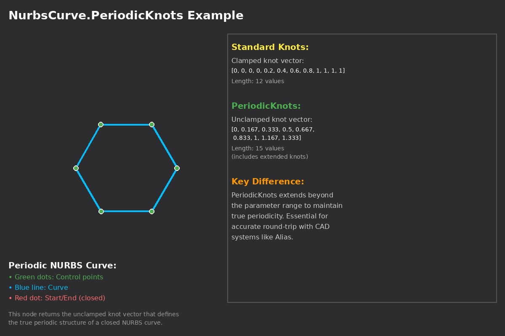

## In Depth
PeriodicKnots returns the unclamped knot vector of a periodic NURBS curve. Unlike the standard Knots property which returns a clamped knot vector, PeriodicKnots provides the true periodic representation of the knot sequence, which is essential for maintaining geometric accuracy when working with periodic curves, particularly in workflows involving other CAD systems like Alias.

A periodic NURBS curve is one that forms a smooth, closed loop without endpoints. For such curves, the knot vector needs to extend beyond the parameter range to ensure smoothness at the closure point. The standard Knots property clamps this vector to the parameter domain, but PeriodicKnots returns the full unclamped vector that defines the curve's periodicity.

In the example below, we create a periodic NURBS curve using NurbsCurve.ByControlPoints with the isPeriodic parameter set to true. We then compare the output of the standard Knots property with PeriodicKnots to demonstrate the difference. The PeriodicKnots output will have additional knot values that extend beyond the parameter range, revealing the true periodic structure of the curve.

This node is particularly useful when you need to export periodic curves to other systems, analyze the underlying mathematical structure of periodic NURBS, or ensure round-trip accuracy when exchanging geometric data with applications like Alias.
___
## Example File

