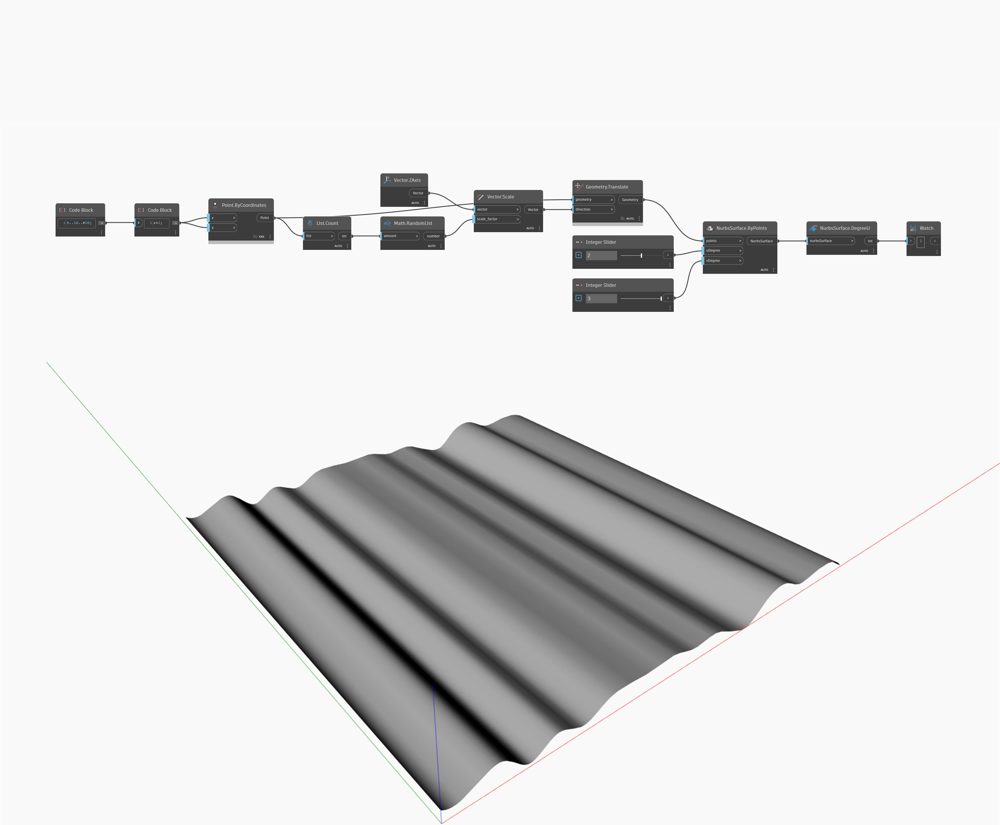

## In Depth
DegreeU will return the degree of a NurbsSurface in the U direction. In the example below, a NurbsSurface created with Points and specified U/V degrees has a degree of 2 in the U direction. Adjusting the number sliders will change the U and V degree values.
___
## Example File

