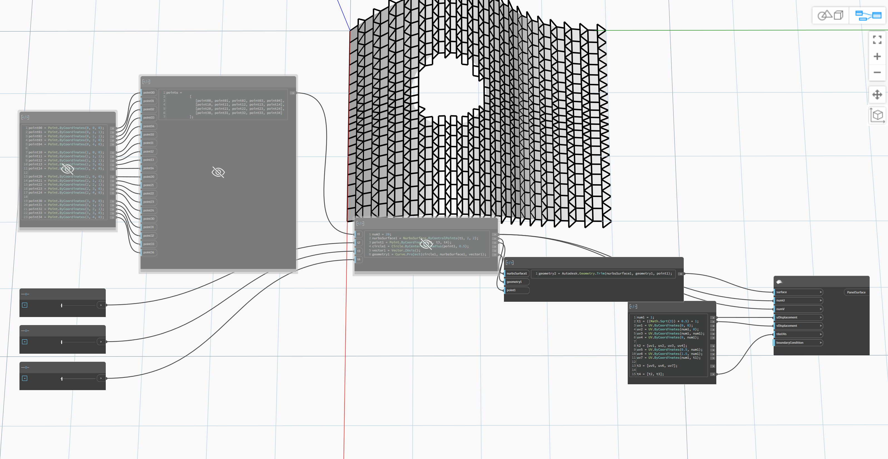

## In Depth
Panels the input surface with a custom tiling pattern. The tiles are polygons in UV parameter space. They can be non-convex but must not self-intersect. It is not compulsory for the set of tiles to be touching edge-to-edge. The paneling pattern is generated by displacing copies of the tiles along the u and v directions by the supplied displacements. The UV coordinates of the vertices of each tile are provided in the tileUVs argument.
___
## Example File

