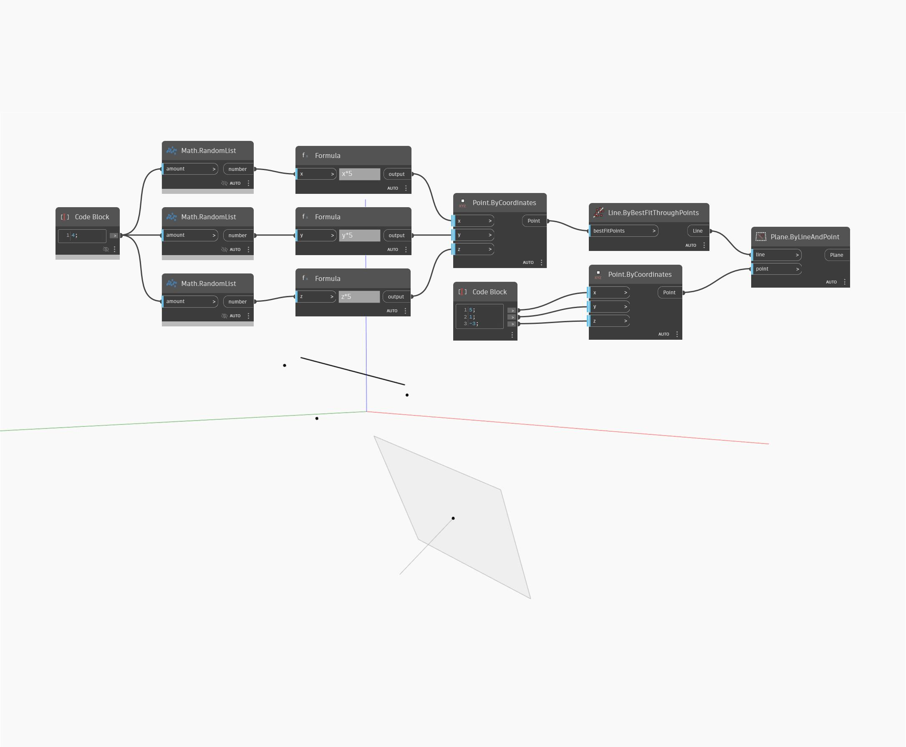

## In Depth
Plane by Line and Point creates a plane using the input Point as the origin, and passing through the input line. The point must not lie on the axis of the line. In the example, we create a line by first using a set of random points and then creating a line with ByBestFitThroughPoints. An origin point is created with a code block providing the x,y, and z coordinates for a Point.ByCoordinates component. We then use the line and point as inputs to create a Plane by Line and Point.
___
## Example File

