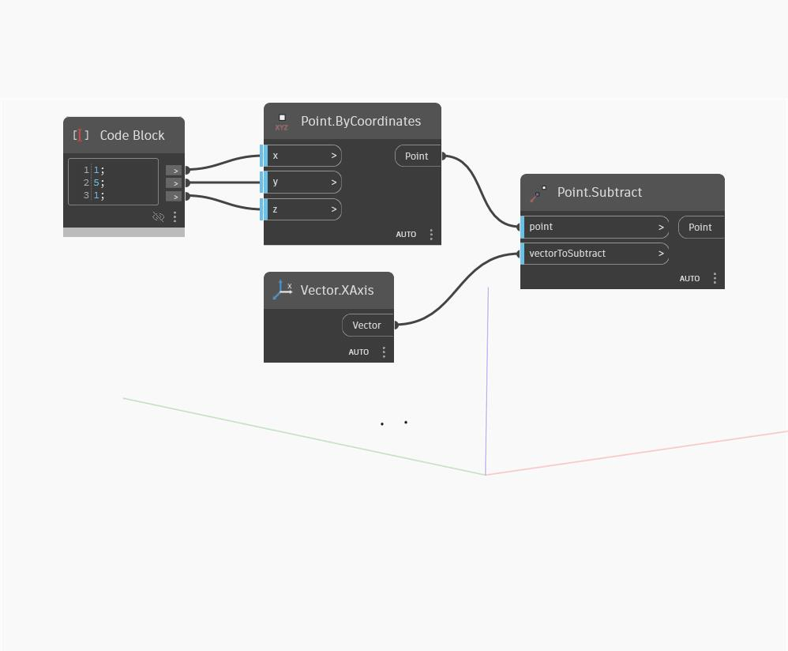

## In Depth
`Point.Subtract` subtracts the x, y, and z components of an input vector from the corresponding coordinates of the input point. This is the same as translating the point by the reverse of a given vector. 

In the example below, we create a point using a code block to specify the x, y, and z coordinates, then add a world XAxis vector as the `vectorToSubtract`. The result is the point translated by a distance of 1 in the negative-x direction.

___
## Example File

