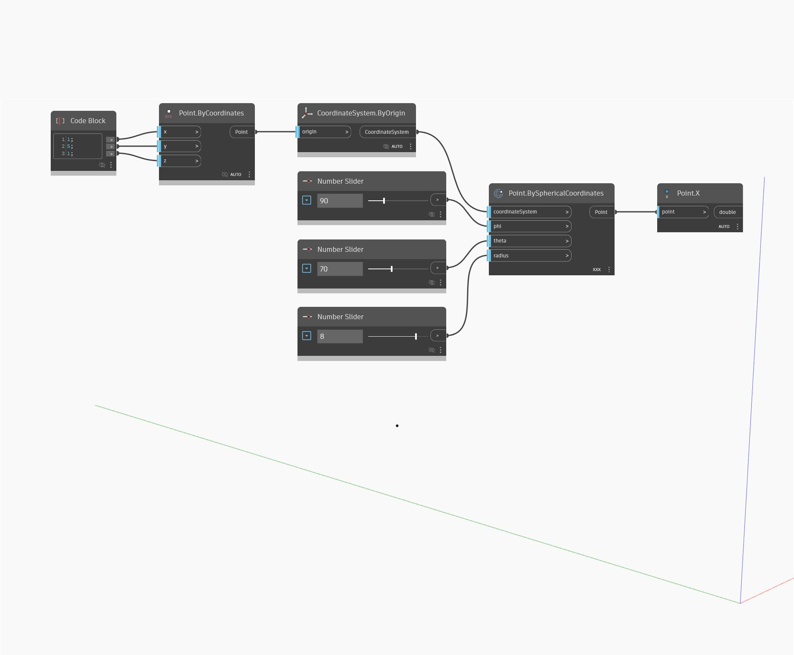

## In Depth
`Point.X` returns the world space x value of an input point. 

In the example below, we use `Point.BySphericalCoordinates` to create a point and then use `Point.X` to return its x coordinate.

___
## Example File

