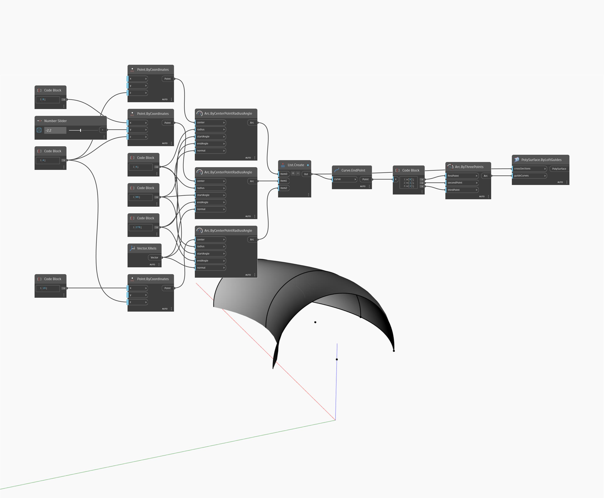

## In Depth
ByLoftGuides will return a PolySurface by lofting through a list of PolyCurves (crossSections). In the example below, a PolySurface is created by lofting through three arcs and an arc guideCurve. The arcs give the loft its cross section, and the guideCurve gives the loft a rail to follow.
___
## Example File

