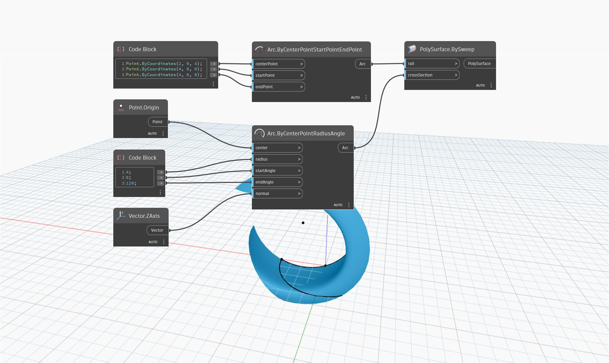

## In Depth
`PolySurface.BySweep (rail, crossSection)` returns a PolySurface by sweeping a list of connected, non-intersecting lines along a rail. The `crossSection` input can receive a list of connected curves that must meet at a start or end point, or the node will not return a PolySurface. This node is similar to `PolySurface.BySweep (rail, profile)` with the only difference being that the `crossSection` input takes a list of curves while `profile` only takes one curve.

In the example below, a PolySurface is created by sweeping along an arc. 

___
## Example File

