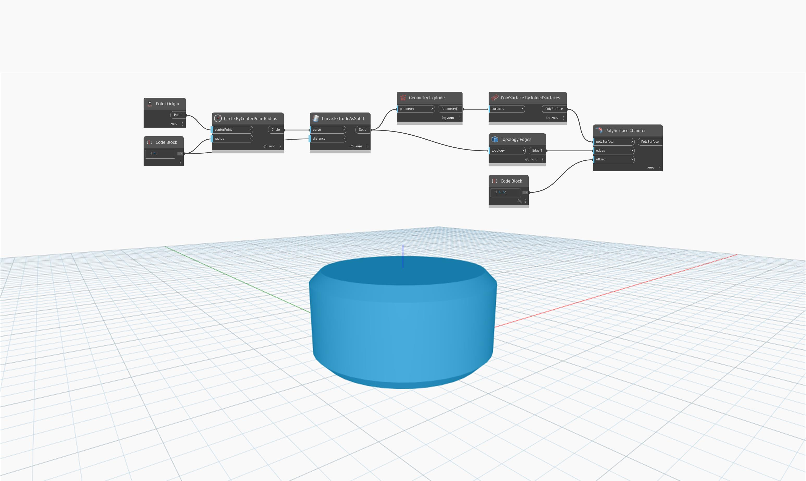

## In Depth
`PolySurface.Chamfer` returns a new PolySurface with chamfered edges defined by the `offset` input. 

In the example below, a new PolySurface is returned by chamfering the top and bottom edges of a cylinder by a 0.5 offset. The offset input must be small enough to fit on the PolySurface. This node is similar to `PolySurface.Fillet`, but it returns a PolySurface with new edges.

___
## Example File

