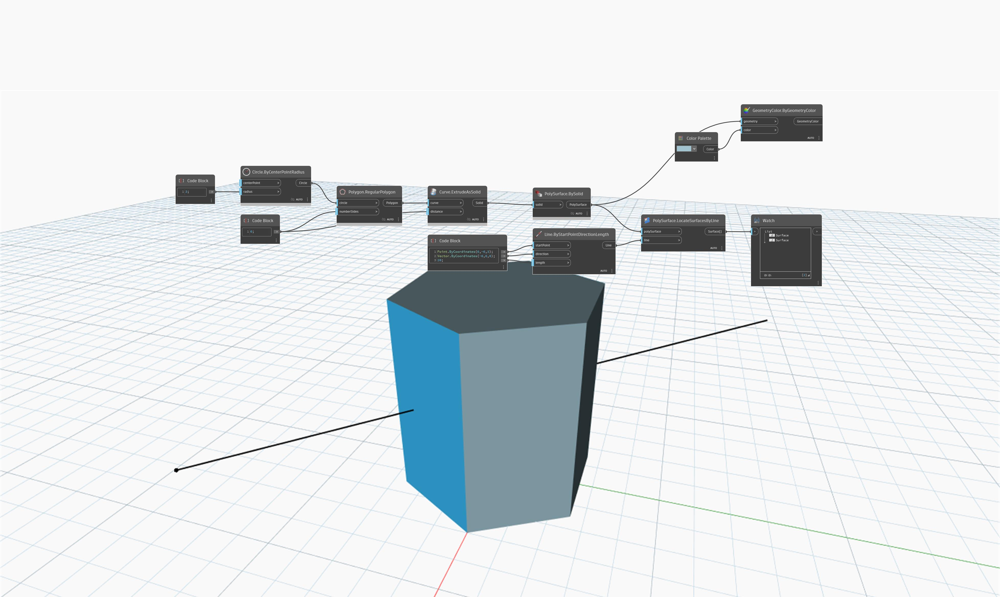

## In Depth
`PolySurface.LocateSurfacesByLine` returns all surfaces that a line intersects. 

In the example below, a line is found to pass through an extruded hexagon at two places and returns two surfaces.

___
## Example File

