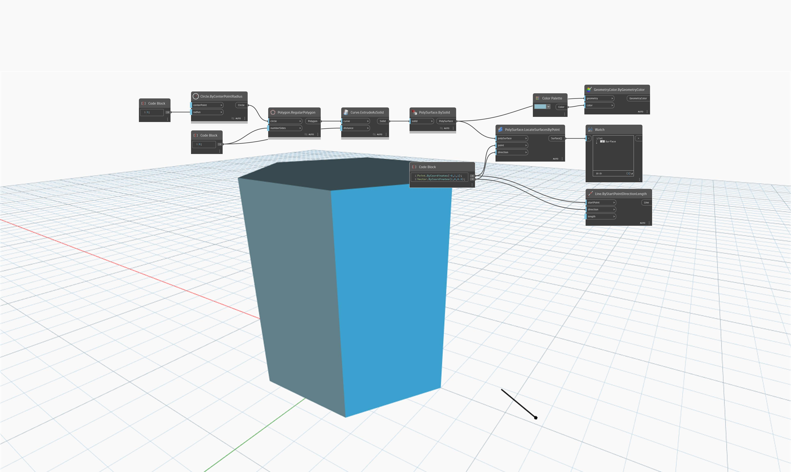

## In Depth
`PolySurface.LocateSurfacesByPoint` returns the first surface intersected in the forward direction as defined by a vector. 

In the example below, the surface returned is intersected by a vector originating at the point. The vector is represented as a line.

___
## Example File

